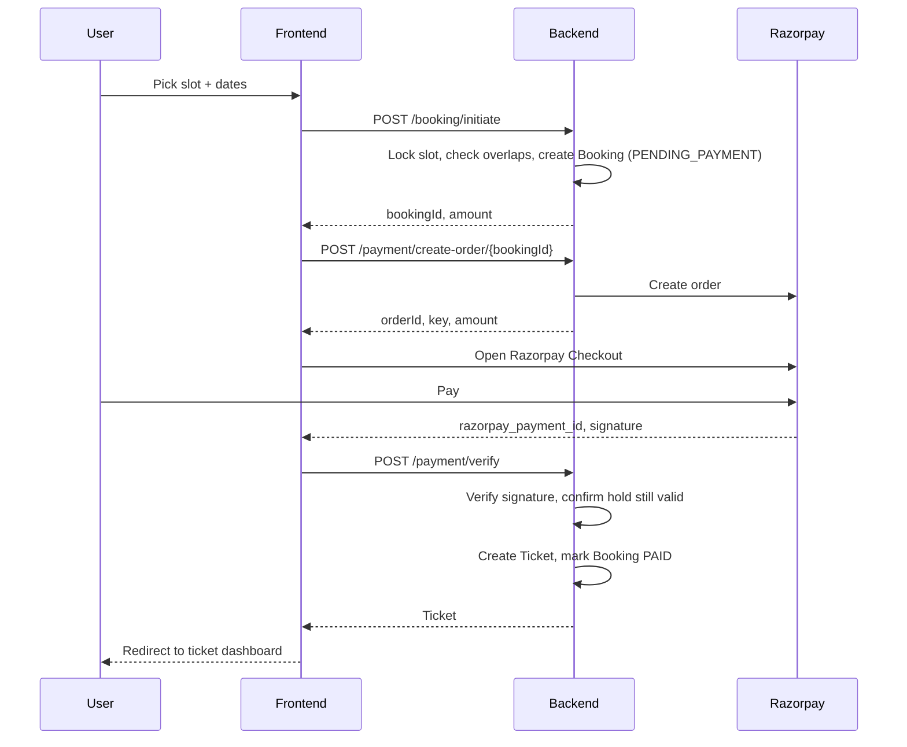

# ParkWise

A full-stack, multi-floor parking management system with reservation-based booking, dynamic pricing, and a real payment gateway integration — built as a portfolio project to explore concurrency-safe booking, caching, and payment-gated ticket lifecycles.

**Stack:** Spring Boot · Hibernate/JPA · MySQL · Redis · React · Tailwind CSS · Razorpay

**Live Demo:** https://parkease-f8e8k37iz-acme-e728.vercel.app

---

## Overview

ParkWise manages a parking lot end to end: floors and slots, vehicle entry/exit, walk-in and advance reservations, dynamic hourly pricing, and payment collection through Razorpay — with the concurrency safeguards needed so two people can't pay for the same slot at once.

The project was built iteratively, starting from basic CRUD slot management and layering in caching, pessimistic locking, and a full payment-hold architecture as the system grew closer to how a real paid parking product would need to behave.

---

## Key Features

**Parking Core**
- Multi-floor slot management with per-floor and per-lot availability counts
- Vehicle entry/exit lifecycle with automatic vehicle registration by number plate
- Four booking types: `INSTANT` (walk-in), `DAILY`, `WEEKLY`, `MONTHLY`
- Dynamic hourly pricing by vehicle type (car / bike / truck)
- Slot-type matching (a bike can't park in a truck bay, etc.)
- Automatic queueing when a vehicle type has no available slot

**Payments**
- Full Razorpay integration: server-side order creation, signature verification, and payment confirmation
- **Reservations are payment-gated before the ticket exists** — a temporary `Booking` hold is created first (`PENDING_PAYMENT` → `PAID`/`EXPIRED`/`CANCELLED`), and the real `Ticket` is only created after payment is verified
- **Walk-in exits are payment-gated before the ticket closes** — the fare is calculated and locked in when exit is requested, charged through Razorpay, and only then does the ticket close and the slot free up
- Fare is calculated once and never silently recalculated after payment, so the amount charged always matches the amount recorded

**Concurrency & Reliability**
- Pessimistic row-level locking on slot selection to prevent two simultaneous bookings of the same slot
- Booking holds block *other* in-progress payments on the same slot/date range — a slot mid-checkout shows as reserved, not available, to everyone else
- Scheduler-based auto-expiry: abandoned payment holds release the slot after a timeout; overstayed instant tickets are automatically flagged and priced at a fixed window
- Redis caching on slot-availability lookups, with cache eviction wired into every booking, payment, and unpark event to avoid serving stale availability

**Frontend**
- Visual slot map with live status coloring (available / reserved / occupied) and a legend
- Integrated Razorpay Checkout flow triggered directly from slot selection or ticket unparking
- Ticket dashboard (Open / Expired / Closed tabs, 30-second auto-refresh) styled as ticket-stub cards
- Admin views for slot and floor management
- Simulated role switching (admin/user) via a lightweight login screen — **not backed by real authentication**; this is UI-level role branching only, not verified access control

---

## Architecture: Reservation Payment Flow



A background scheduler flips any `Booking` still `PENDING_PAYMENT` past its expiry window to `EXPIRED`, freeing the slot for others. The same payment-then-finalize pattern is used for walk-in exits: `request-exit` locks in the fare, Razorpay collects it, and only on verified payment does the ticket actually close.

---

## Project Structure

```
parkwise/
├── backend/
│   └── src/main/java/com/parkingsystem/parkingsystem/
│       ├── entity/          # Slot, Floor, Ticket, Vehicle, Booking, Payment, enums
│       ├── repository/      # Spring Data JPA repositories + overlap/lock queries
│       ├── service/         # Interfaces
│       ├── service/impl/    # SlotImpl, VehicleImpl, BookingImpl, PaymentImpl, ...
│       ├── controller/      # REST controllers
│       ├── util/            # TicketPricingUtil (shared fare calculation)
│       └── config/          # RazorpayConfig, Redis config
└── frontend/
    └── src/
        ├── components/
        │   ├── admin/        # AdminSlot, AdminFloor
        │   ├── Slot.jsx       # Visual slot map + checkout
        │   ├── Parking.jsx    # Manual walk-in booking + unpark
        │   ├── TicketDashboard.jsx
        │   └── ...
        ├── services/         # apiClient, PaymentService, RazorpayService, UnParkService
        └── theme.css         # Tailwind v4 design tokens
```

---

## Getting Started

### Backend

1. Create a MySQL database and a Redis instance (local or Docker).
2. Set the following in `application.properties` / environment variables:
   ```properties
   spring.datasource.url=jdbc:mysql://localhost:3306/parkwise
   spring.datasource.username=<your-username>
   spring.datasource.password=<your-password>

   spring.redis.host=localhost
   spring.redis.port=6379

   razorpay.key.id=<your-razorpay-key-id>
   razorpay.key.secret=<your-razorpay-key-secret>
   ```
3. Run the Spring Boot application (`./mvnw spring-boot:run` or via your IDE).

### Frontend

1. `cd frontend && npm install`
2. Add the Razorpay Checkout script to `index.html`:
   ```html
   <script src="https://checkout.razorpay.com/v1/checkout.js"></script>
   ```
3. `npm run dev`

---

## API Overview

| Area | Endpoint | Purpose |
|---|---|---|
| Slots | `GET /slot/available` | Slot availability for a floor + date range |
| Slots | `POST /slot/create-slot/{floorId}` | Admin: create slots on a floor |
| Floors | `GET /floor/parking-lot/{lotId}` | List floors |
| Vehicles | `POST /vehicle/park-by-slot` | Instant walk-in parking |
| Vehicles | `POST /vehicle/request-exit/{ticketNumber}` | Lock in exit fare before payment |
| Vehicles | `POST /vehicle/unpark/{ticketNumber}` | Close a reservation ticket (already paid) |
| Bookings | `POST /booking/initiate` | Create a payment hold for a reservation |
| Payments | `POST /payment/create-order/{bookingId}` | Razorpay order for a reservation |
| Payments | `POST /payment/create-exit-order/{ticketNumber}` | Razorpay order for a walk-in exit fare |
| Payments | `POST /payment/verify` | Verify signature, finalize ticket |
| Tickets | `GET /ticket/get-ticket/{status}` | Tickets by status (OPEN/EXPIRED/CLOSED) |

---

## Known Limitations

- **No real authentication.** Role selection is a `localStorage`-backed UI switch, not verified login — anyone can navigate directly to admin routes.
- **No automated refund handling.** If a payment succeeds right as its hold or exit window expires, the code correctly avoids creating/closing a ticket, but the actual refund isn't automated — it needs a manual/API-triggered Razorpay refund.
- **No frontend test suite yet.**

## Roadmap

- Real authentication (JWT or session-based)
- Automated refund handling for the expiry-race edge case
- WebSocket-based live slot updates (currently polling-based on the ticket dashboard only)
- Telegram bot notifications
- Pagination on ticket/slot lists

---

## Owner

Jeel Shah
